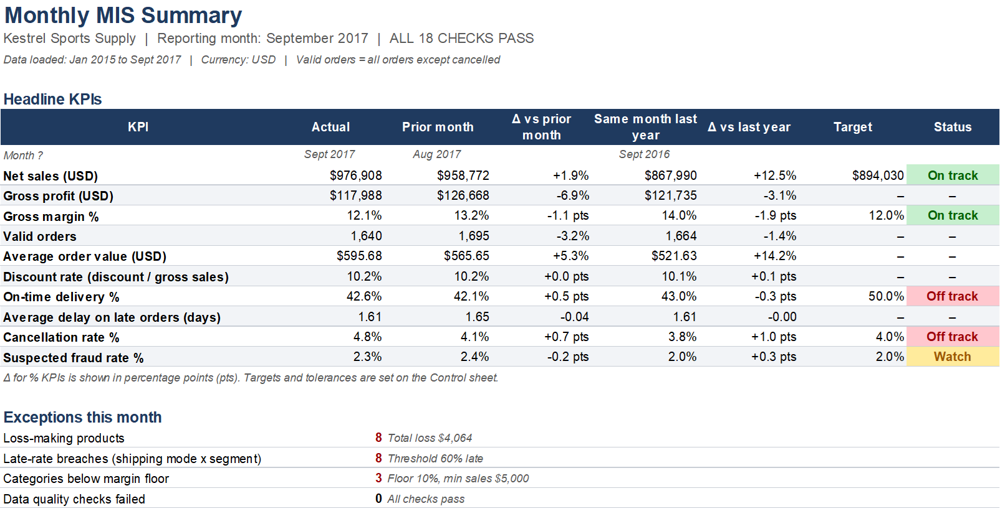
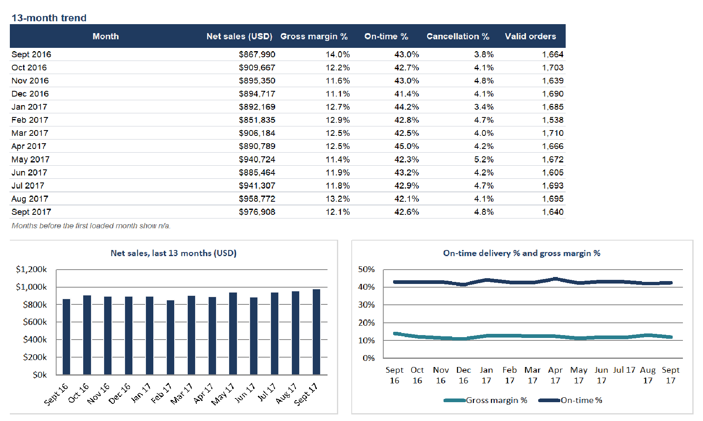
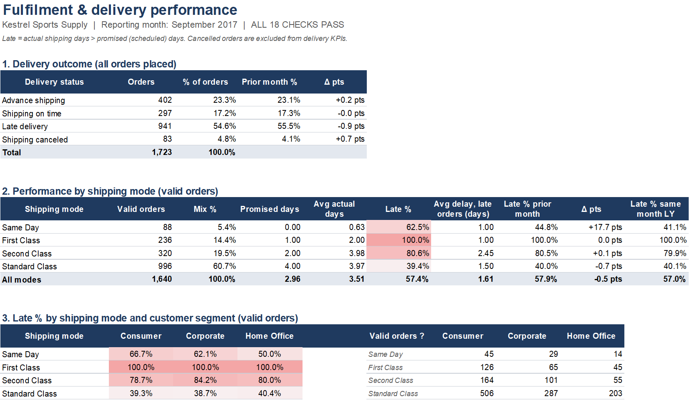
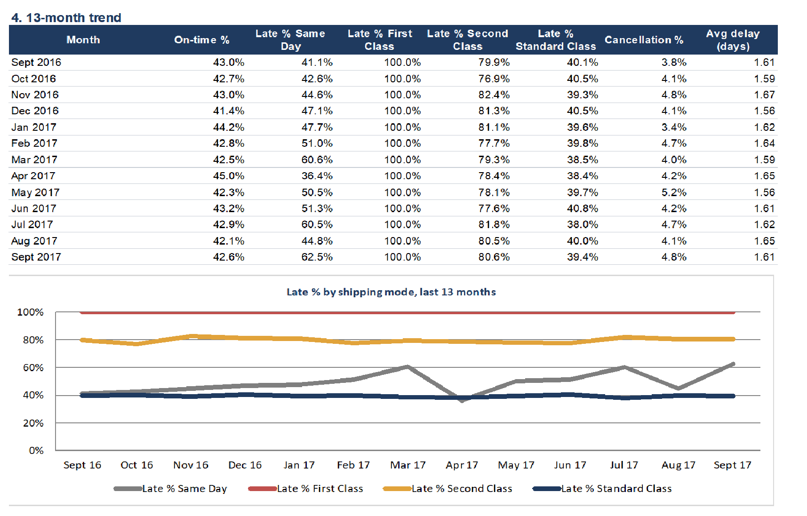
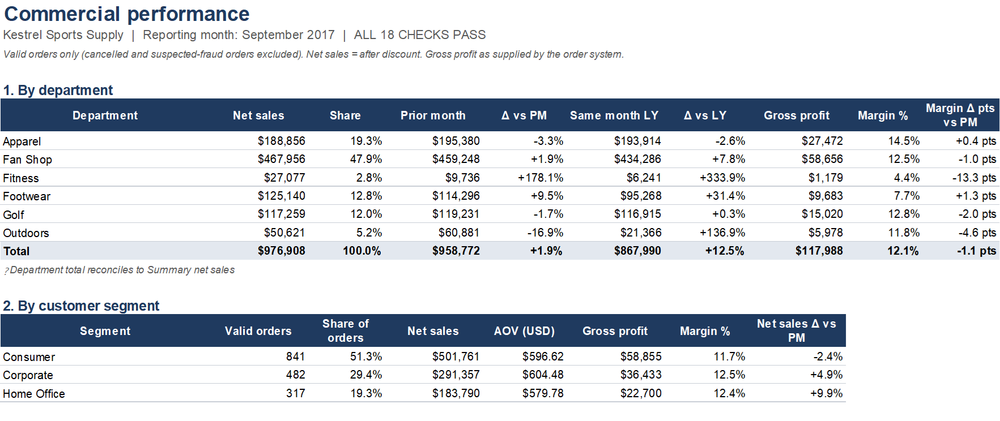
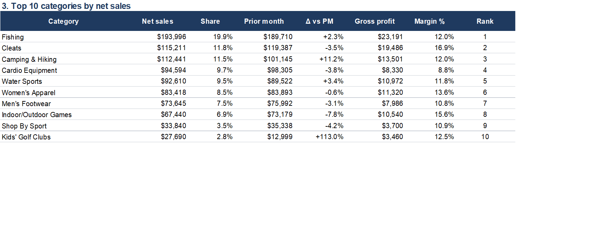
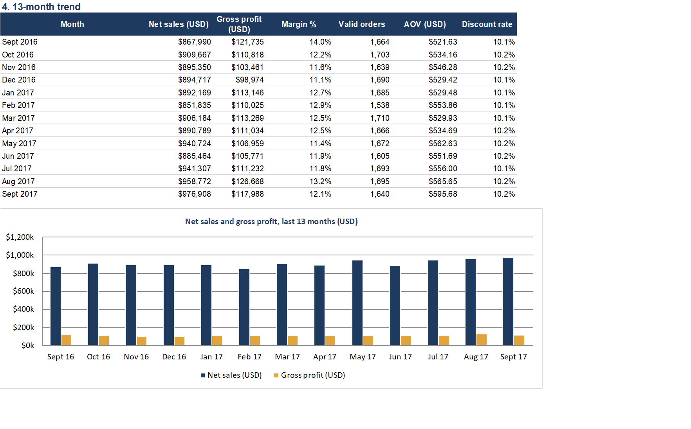
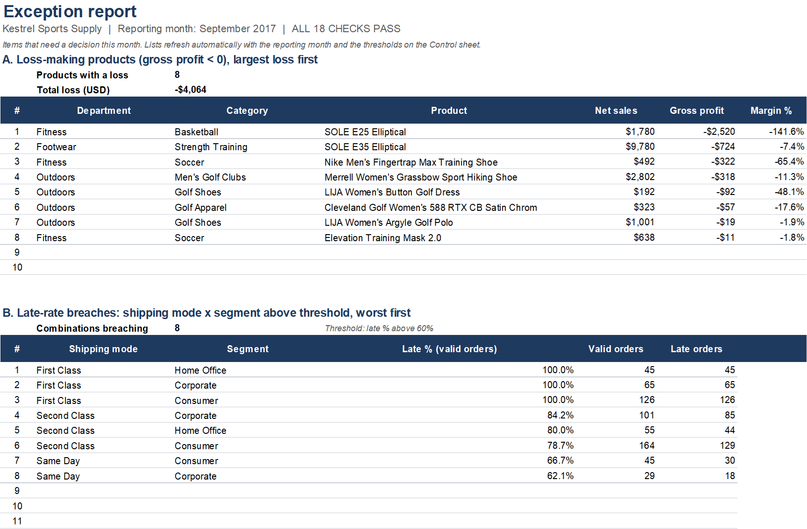
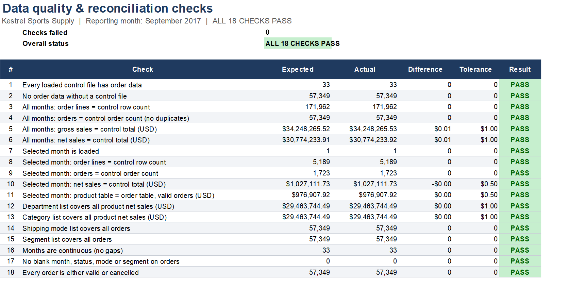
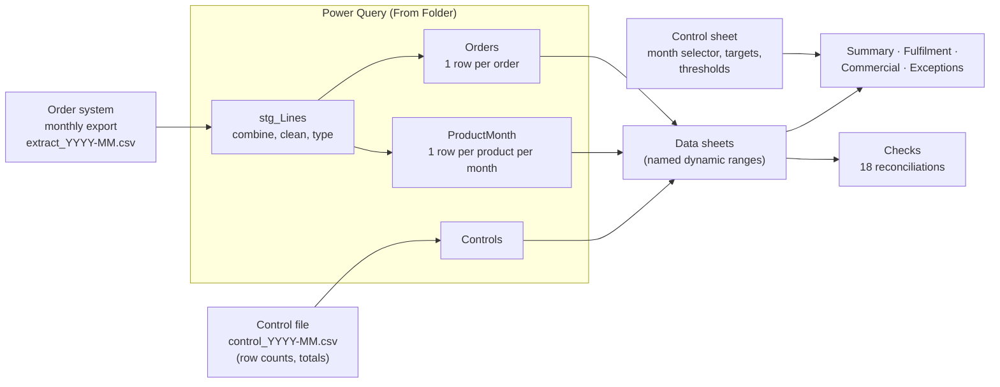

# Monthly Operations & Fulfilment MIS Pack (Excel + Power Query)

A monthly management information (MIS) pack for a sporting-goods distributor, built in Excel. It refreshes from the order system's monthly export files, **reconciles every load to the system's control totals**, reports 10 KPIs against prior month, last year and target, and produces an exception report of the items that need a decision.

> **Context:** *Kestrel Sports Supply* is a **simulated** business, created to frame the project as a real reporting engagement. The data is the public **DataCo Smart Supply Chain** dataset ([Kaggle](https://www.kaggle.com/datasets/shashwatwork/dataco-smart-supply-chain-for-big-data-analysis); Constante, Silva & Pereira, Mendeley Data, DOI 10.17632/8gx2fvg2k6). The stakeholders, targets and recommendations were written by the author. Kestrel is not a real company or employer.

**Tools:** Microsoft 365 Excel · Power Query (M) · named dynamic ranges · SUMIFS/COUNTIFS · INDEX/MATCH · array formulas · data validation · conditional formatting

---

## Screenshots (September 2017)

### 1. MIS Summary
The headline KPIs against prior month, last year and target, each with a status flag, plus a count of this month's exceptions.



### 2. Fulfilment
The delivery outcome mix, performance by shipping mode, late % by mode × customer segment, and the 13-month trend.



### 3. Commercial
Departments and customer segments compared with prior month and last year, the top 10 categories, and the 13-month trend.




### 4. Exceptions
Loss-making products and late-rate breaches, worst first.


### 5. Checks
18 data quality and reconciliation checks against the source system's control totals.


---

## The business problem

The monthly pack was assembled by hand from the order-system export. This had three costs:
- It took most of a working day.
- It never reconciled to the source system.
- Delivery problems and loss-making products were found only by chance.

The pack needed to:
1. Refresh with one action.
2. Prove it reconciles.
3. Show a standard set of KPIs against target.
4. List what needs action.

Full scope: [`docs/01_requirements_note.md`](docs/01_requirements_note.md)

## How it works



- **A new month takes four steps:** drop the two files in `monthly_extracts/`, click **Refresh All**, pick the month on the Control sheet, and confirm **ALL 18 CHECKS PASS**. See [`docs/04_refresh_procedure.md`](docs/04_refresh_procedure.md).
- **Reconciliation comes first.** The source system's control file is checked against the loaded data for row count, order count, gross sales and net sales, per month and in total. A truncated or duplicated export fails visibly before anyone reads a number.
- **The grain is chosen deliberately.** The export is at order-line level. Delivery KPIs are counted per order, so a 3-line order is one delivery, not three. Sales and profit are summed from lines.
- **No hard-coding.** Targets, tolerances and exception thresholds are inputs on the Control sheet. Report tables read reference lists, and the checks fail when a new category or mode appears, so nothing silently drops out of a total.
- **It survives a reload.** Formulas reference named dynamic ranges (e.g. `O_NetSales`) rather than fixed cell ranges, so they keep working when Power Query reloads a different number of rows.

## Findings — September 2017

Full memo: [`docs/05_findings_memo_2017-09.md`](docs/05_findings_memo_2017-09.md)

1. **Record sales month:** net sales of $976.9k, the highest of 33 months (+12.5% year on year, against a +3% target). The growth came from average order value (+5.3% vs August), while orders fell 3.2%.
2. **The on-time miss is structural:** 42.6% against a 50% target, and between 40% and 45% in every month. First Class promises 1 day and takes 2 days on every order, and Second Class ships no faster than Standard. Premium modes are 34% of orders but 53% of late orders.
3. **Cancellations at 4.8%** against a 4.0% target, and above target in 27 of 33 months.
4. **Eight loss-making products (−$4,064).** The two largest are elliptical trainers sold for the first time this month.
5. **The reconciliation caught a data issue:** a new category ("Basketball") arrived containing bikes and an elliptical trainer. This looks like a product-master mapping error, and it was logged.

## Repository structure

```
kestrel-mis-pack/
├── Kestrel_Monthly_MIS_Pack.xlsx      the workbook (Jan 2015 – Sep 2017 loaded, live Power Query connections)
├── monthly_extracts/                  simulated monthly export + control files (33 months)
├── power_query/                       M code for the 5 queries (pExtractFolder, stg_Lines, Orders, ProductMonth, Controls)
├── scripts/make_monthly_extracts.py   splits the public dataset into the simulated monthly feed
├── docs/
│   ├── 01_requirements_note.md
│   ├── 02_kpi_definitions.md
│   ├── 03_data_quality_log.md
│   ├── 04_refresh_procedure.md
│   └── 05_findings_memo_2017-09.md
└── images/                            screenshots
```

## Running it

1. Clone the repo and open `Kestrel_Monthly_MIS_Pack.xlsx` in Microsoft 365 Excel (Windows). The Power Query connections are already set up.
2. Point the `pExtractFolder` parameter at your copy of `monthly_extracts/` (**Data → Get Data → Launch Power Query Editor**, then select `pExtractFolder`). After that, **Data → Refresh All** works.
3. The monthly refresh is documented in [`docs/04_refresh_procedure.md`](docs/04_refresh_procedure.md). Part D records how September 2017 was loaded, including the reconciliation check that caught a new category.

To regenerate the monthly files from the original Kaggle download:
`python scripts/make_monthly_extracts.py path/to/DataCoSupplyChainDataset.csv`

## Data quality decisions (summary)

15 issues are logged in [`docs/03_data_quality_log.md`](docs/03_data_quality_log.md). The ones that shaped the design:

- **October 2017 – January 2018 is excluded.** The source changes structure in those months: the product range shrinks, and every order becomes single-line.
- **Market is not reported.** The dataset assigns markets in rotating blocks of months, so a market comparison would measure the rotation, not performance.
- **Dates are parsed with a fixed US culture.** The source dates are US-format text, so an Irish or UK PC would otherwise misread them.
- **"Order Profit Per Order" is a line-level value.** Despite its name, it is treated as line profit and summed.

## Limitations

- The dataset is synthetic, and some patterns are fixed by construction, such as the shipping days per mode. The findings are framed as the questions an analyst would raise, not as proven causes.
- The targets are illustrative and were set by the author.
- Currency is USD, as supplied.

---

**Author:** Sayanth Rajani Divakaran · MSc Data Analytics (Dublin Business School)
